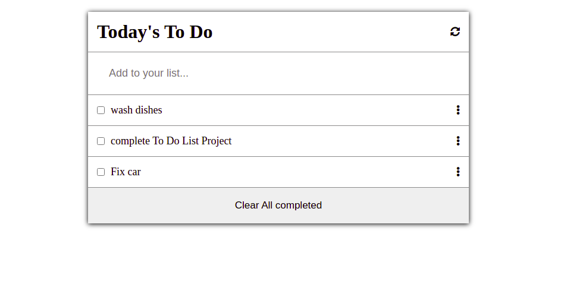

# Todo List

"Todo List" is a simple website that displays a list of todos and allows you to add,edit and remove todos from that list.

## Screenshots

## Live Demo

[Live Demo Link](https://wuyepabdul.github.io/Todo-List/)

## Built With

- HTML
- CSS
- JS

## Getting Started

**To clone this project**
**Run command: $git clone https://github.com/wuyepabdul/Todo-List.git**
**or press the green Code button in the upper right corner and choose to download from the Download ZIP link.**

### Prerequisites

- Code editor (VS Code, Sublime, Atom)

## Authors

👤 **Author1**

- GitHub:[@Wuyep Abdul](https://www.github.com/wuyepabdul)
- LinkedIn:[@Abdul_Wuyep](https://www.linkedin.com/in/abdul-wuyep-6a27721b8/)

## Show your support

Give a ⭐️ if you like this project!

## 📝 License

This project is [MIT](./MIT.md) licensed.
